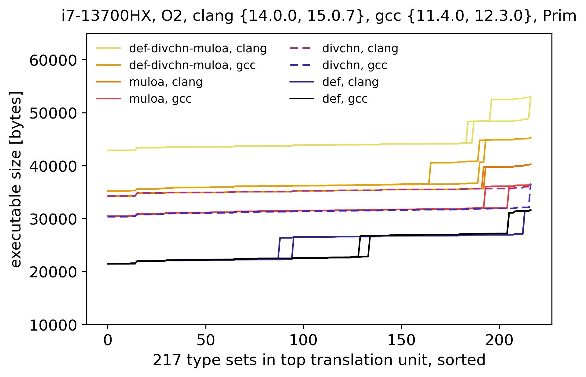
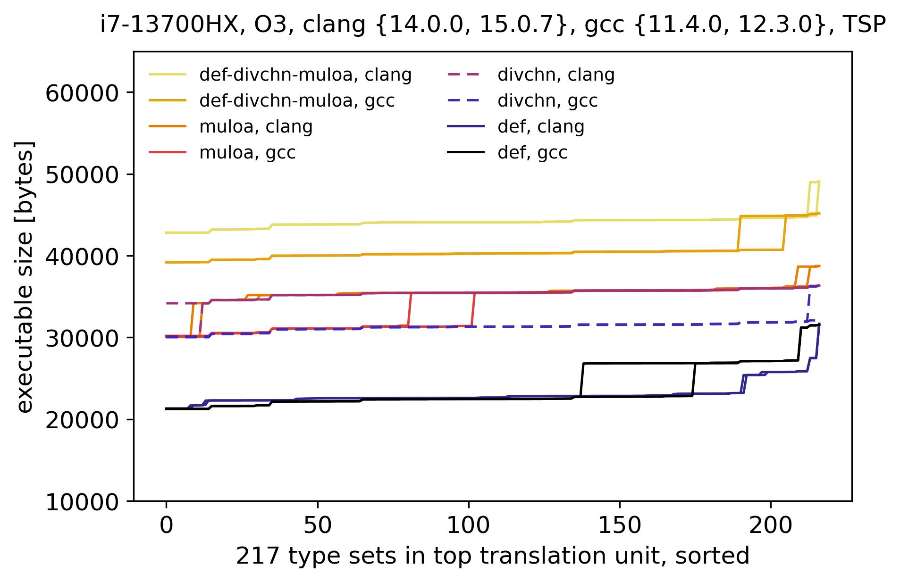
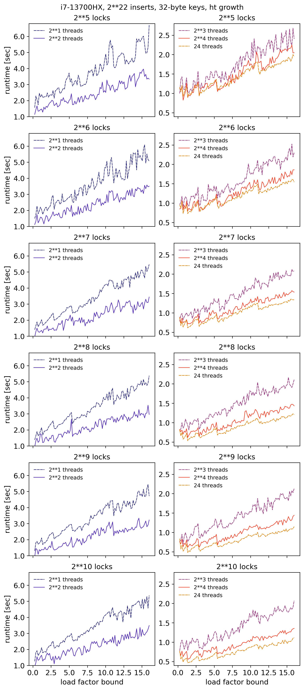

# Low memory footprint: hashing parametrization and C generics

A low memory footprint in graph algorithms and supporting data structures is achieved by parametrizing the hashing and using the generics in C.

An original approach to in-memory alignment is provided to enable cache-efficient type generics. A decomposition of common graph algorithms into small type-specific operations is demonstrated, while utilizing the "understanding" of memcpy by modern compilers. The provided algorithms and data structures are extremely portable.

The implementation only uses integer and pointer operations (no floating point except in tests). Given parameter values within the specified ranges, the implementation provides an error message and an exit is executed if an integer overflow is attempted or an allocation is not completed due to insufficient resources. This behavior invariant holds across all abstraction levels.

The rigorous compliance with the C standards and adherence to program safety are combined with an exploration of the boundaries of the C language and its translation, which may potentially contribute to further C standardization and enable new mission-critical applications across a broad hardware spectrum.

# Hashing optimization: graph-conscious hashing

Graph-conscious hashing is formulated. The approach reflects the perspective that graph problems often reduce to hashing problems, where the topology of a graph informs an optimal hashing method.

A graph problem reduced to a hashing problem is an ordered set of a graph topology, an algorithm, and a hash function, where the set maps to a distribution of hash values.

Information about a graph topology can often be obtained from a problem statement and/or the prior knowledge of a domain. Additional information, such as the indegree of each vertex in a graph or a subset of vertices, can be stored at the time of graph construction.

Based on the preliminary data, the provided implementation motivates the development and evaluation of graph-conscious hashing methods. It is anticipated that the following examples will be evaluated in the near future:

- the constant integers used for the multiplication and modulo operations in multiplication and division-based hash tables will be (automatically) selected from sets of integers with suitable properties to minimize collisions among frequent hash keys as determined at the time of graph construction,
- a contiguous buffer for storing key element pairs (k, e), where k is in the set of frequent hash keys as determined at the time of graph construction or dynamically during an algorithm run, and e is in the set of the elements associated with k, will be maintained in memory to decrease the probability of eviction of the cache blocks with (k, e) pairs across LRU and LRU-related replacement policies (i.e. a frequent hash key helps keep another frequent hash key and its element in cache due to spatial proximity in memory).
- contiguous buffers, each for storing key element pairs (k, e), where k is in the set of hash keys corresponding to a graph segment that can be determined in polynomial time at the time of graph construction or dynamically during an algorithm run and where an exact solution of an NP-hard problem runs in exponential time, will be maintained in memory in order to decrease the number of cache misses.

The approach may be particularly suitable for computing and optimizing the exact solutions of small instances of NP-hard problems in memory-constrained environments. Small instances of NP-hard problems may require little space as graphs in memory. However, computing an exact solution may require extensive memory resources without hashing.

The provided implementations of division and multiplication-based hash tables, enable the hashing of contiguous blocks of memory thereby accommodating the hashing of sets of vertices in exact solutions of NP-hard problems.

# Highlights

[graph-algorithms/dfs/README.md](graph-algorithms/dfs/README.md) 
[graph-algorithms/dijkstra/README.md](graph-algorithms/dijkstra/README.md) 
[graph-algorithms/prim/README.md](graph-algorithms/prim/README.md) 
[graph-algorithms/tsp/README.md](graph-algorithms/tsp/README.md) 

The relationship between the executable size and the number of types in a top translation unit was evaluated by compiling 20888 executables across the provided DFS, Dijkstra, Prim, and TSP algorithms. The executable size remained mostly flat as the number of types in top translation units increased. As stated above, the implementation complied rigorously with the C standards, including with respect to types.

    

    

    

    

 

[data-structures-pthread/ht-divchn-pthread/README.md](data-structures-pthread/ht-divchn-pthread/README.md)

A multithreaded highly parametrized generic hash table with chaining for resolving collisions. The design is expected to enable the multithreading of graph algorithms.

    

 

[utilities-pthread/mergesort-pthread/README.md](utilities-pthread/mergesort-pthread/README.md)

The algorithm design and its highly portable implementation may provide a multithreaded sorting benchmark for CPU manufacturers aiming to improve thread execution capability.

    

 

Vectorization and cache efficiency are being profiled, which may result in implementation changes. Additional information related to the style of the provided implementation is available at https://wiki.sei.cmu.edu/confluence/display/c/3+Recommendations.

In each directory with a Makefile, run:

`make` or optionally if available `make BUILD_MODE=M32` or `make BUILD_MODE=M64`

`./executable-name`

`make clean` or `make clean-all`
