## Design

A hash table can be modified by threads calling insert, remove, and/or delete operations concurrently. The hash table design provides the following guarantees with respect to the final state of a hash table, which is defined as a pair of i) a load factor, and ii) a set S consisting of sets of key-element pairs, where the number of sets in S is equal to the number of slots in the hash table\*:
- a single final state is guaranteed after concurrent insert, remove, and/or delete operations if the sets of keys used by threads are disjoint,
- a single final state is guaranteed according to a user-defined element comparison function (e.g. min, max)** after concurrent insert operations if the sets of keys used by threads are not disjoint.

A hash table always reaches a final state, including the single final state if it is guaranteed, because chaining does not limit the number of insertions. According to the hash table design, a thread completes a batch operation i) before a load factor upper bound is exceeded, ii) before the hash table grows when the load factor bound is temporarily*** exceeded, or iii) after the hash table reaches its maximum count of slots on a given system and the load factor is no longer bounded. In ii) and iii) a thread is guaranteed to complete its operation, because for any load factor upper bound, if it is exceeded, the hash table does not limit the number of insertions due to chaining.

The provided design and associated guarantees are suited for the use of hash tables in multithreaded graph algorithms, e.g. in multithreaded looping in an adjacency list.

\* each set in S formally includes a unique token

** other reduction functions to be added in future versions (e.g. add, multiply, and, or, xor)

*** unless the growth step that follows does not lower the load factor sufficiently because the maximum count of slots on a given system is reached during the growth step and the load factor is no longer bounded

    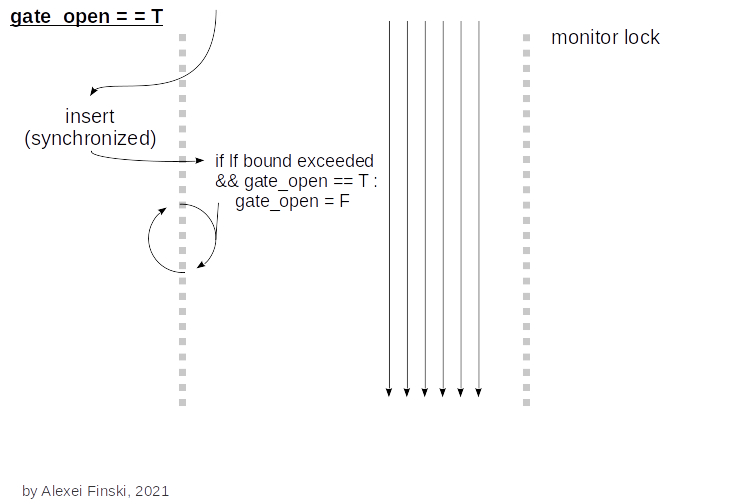
    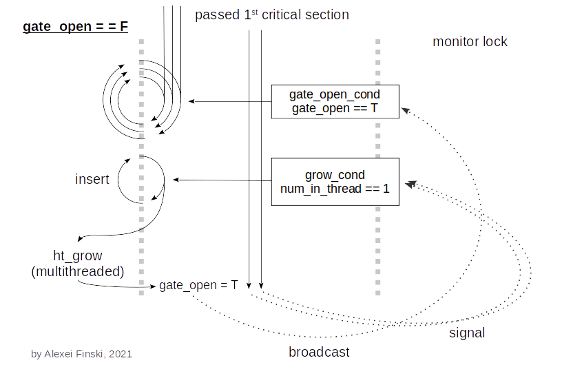
    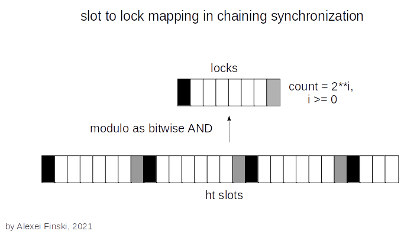

## Evaluation - December 11 2021 implementation

**An optimization of spatiotemporal collisions between threads during insertion into hash table was performed.**

To insert 2**22 distinct nearly random 32-byte long keys and shorter elements, with hash table growth:
- 2\**7 locks resulted in approximately optimal runtime for 2\**1 and 2\**2 threads, and
- 2\**11 locks resulted in approximately optimal runtime for 2\**3, 2\**4, and 24 threads.

The runtime difference between 2\**3, 2\**4, and 24 threads increased with the increasing number of locks.

    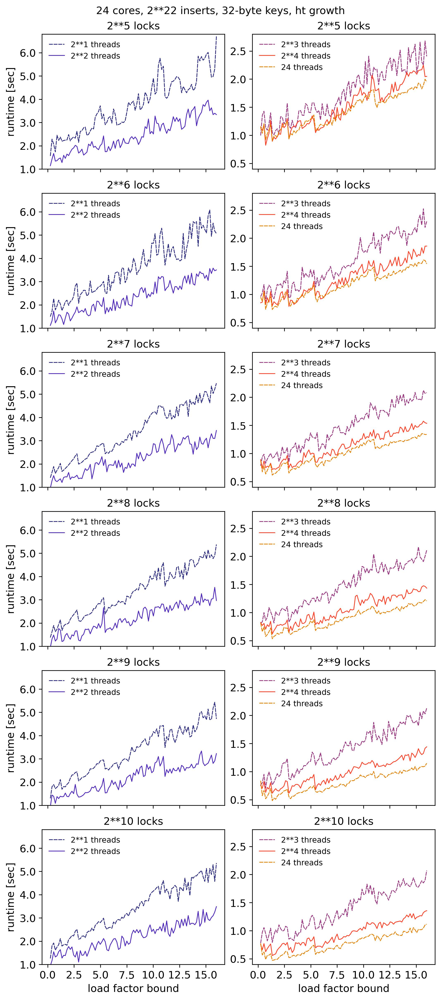
    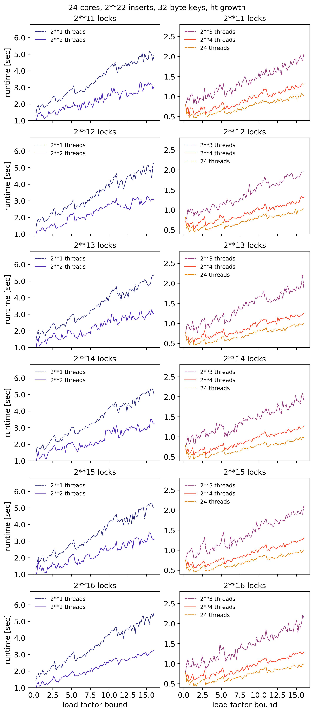

To insert 2\**22 distinct nearly random 32-byte long keys and shorter elements, without hash table growth:
- 2\**7 locks resulted in approximately optimal runtime for 2\**1 and 2\**2 threads, and
- 2\**13 locks resulted in approximately optimal runtime for 2\**3, 2\**4, and 24 threads.

The runtime difference between 2\**3, 2\**4, and 24 threads also increased with the increasing number of locks.

    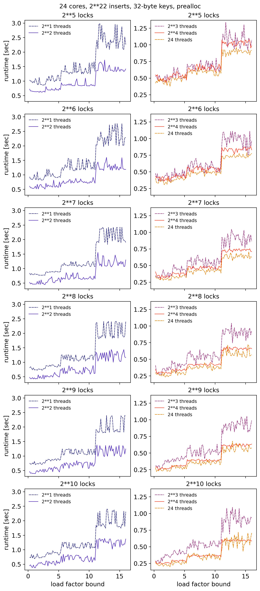
    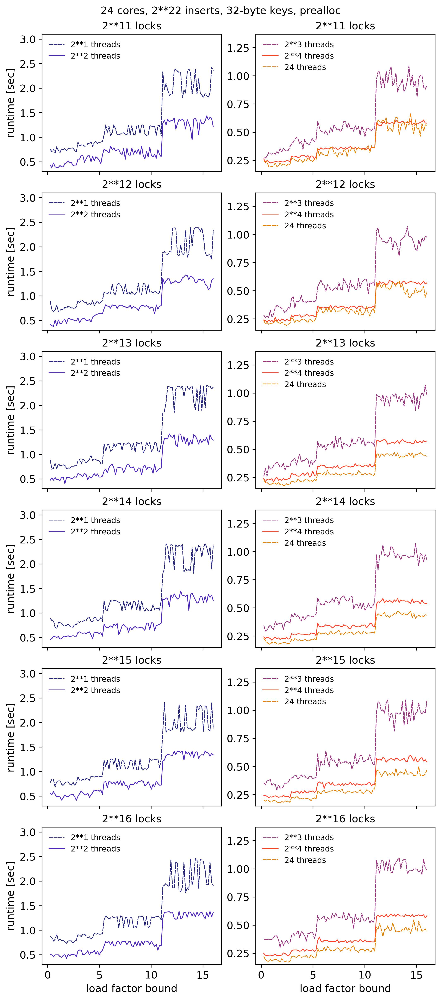

 

**Low runtime variance over a large number of search queries is important in applications of hash tables. The runtime variance of search queries was evaluated with respect to the number of threads, load factor bounds, and key sizes.**

2\**22 distinct nearly random 32-byte long keys and shorter elements were inserted in a hash table. 2\**22 searches were then performed with the keys present in the hash table (in-searches), or with distinct nearly random keys not present in the hash table (out-searches).

The runtime variance of in-searches and out-searches decreased with the number of threads. The decrease in runtime variance was across the load factor bounds used for evaluation.

    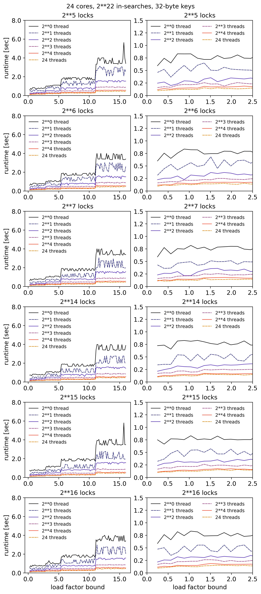
    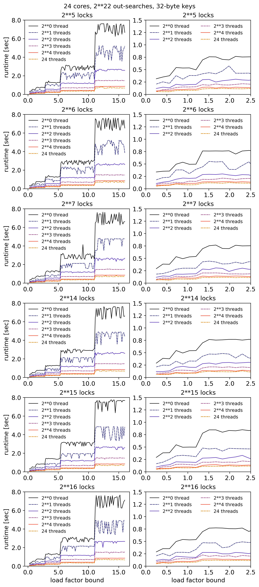

The decrease in runtime variance was also across the key sizes used for evaluation.

    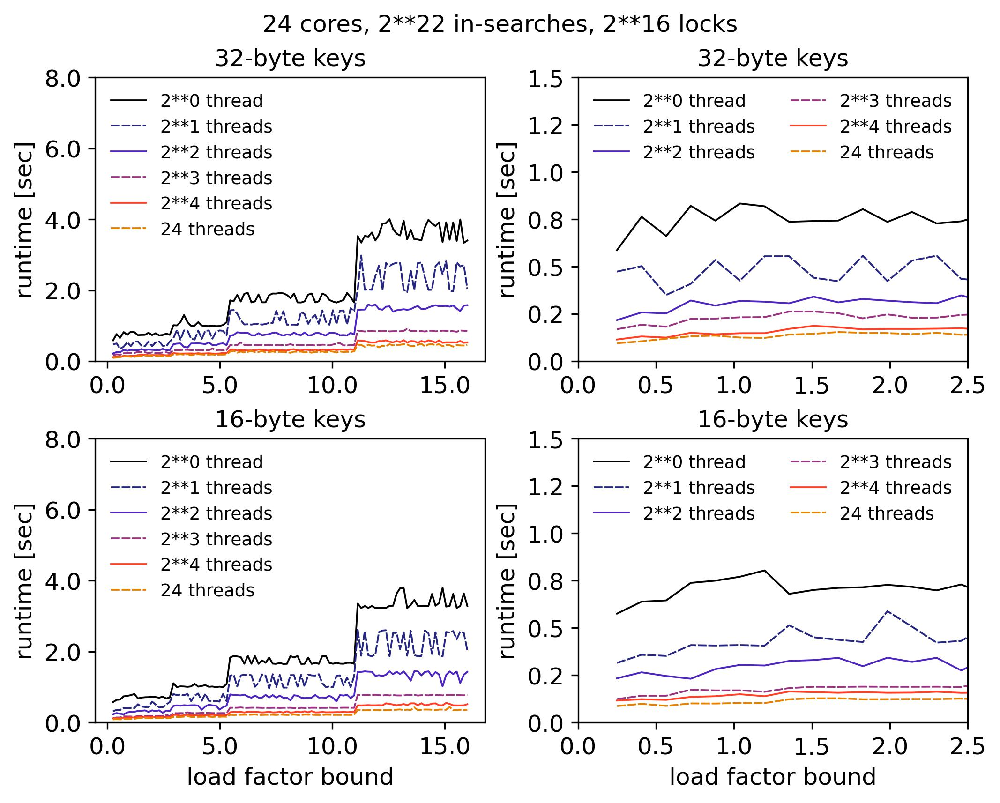
    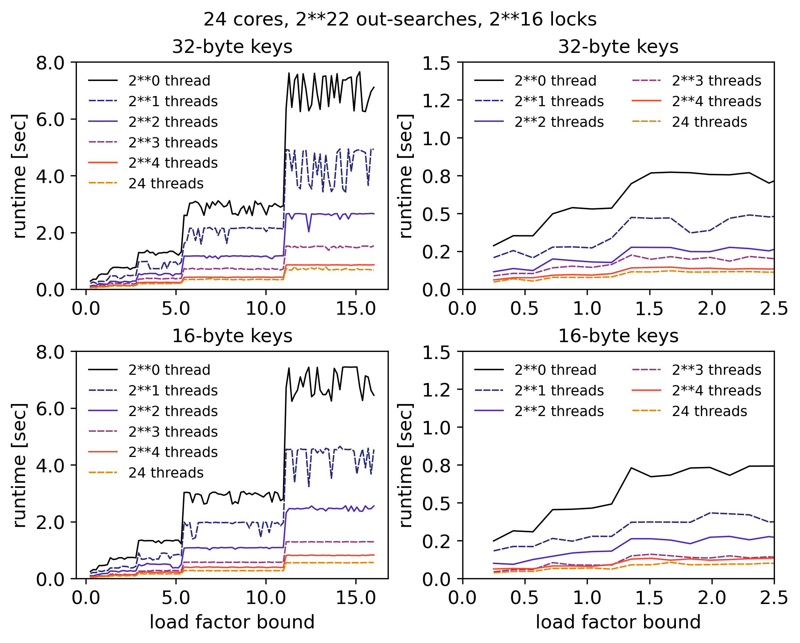

Search queries only required memory reading. Locks were not used to avoid thread synchronization overhead. Because an array of locks was a part of the memory layout, hash tables with different numbers of locks were evaluated to control for memory layout differences.

In summary, the hash table design showed a i) scalable runtime speedup and ii) decrease in runtime variance with the increasing number of threads over a large number of search queries.

##
*Note that the purpose of the above evaluation was to measure parallelism with the number of processors. The number of processors was modeled by the number of threads. The evaluation was performed on a 13th Gen Intel(R) Core(TM) i7-13700HX Processor with Hyper-Threading on 8 of 16 physical cores. The number of “cores” included Intel’s Hyper-Threading Technology and referred to logical cores. Because the hash table design and implementation are extremely portable, the evaluation may be expanded to other hardware settings. The Linux machine used for the above evaluation had a main memory of 16 GB.*
