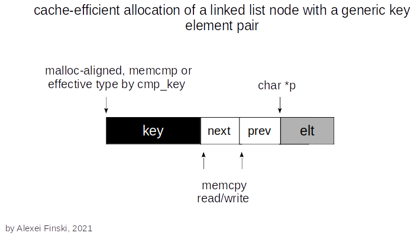

    

Design guarantees:

- Objects are disjoint within a single malloc'ed block of memory. Each object is only accessed with pointer(s) to compatible types, thus complying with the strict aliasing rules.

- The key object satisfies the highest alignment requirement value provided by malloc, and can be used by any user-defined comparison function in relation to the type of a key.

- Before dll_align_elt is executed, the elt_size object has a size, alignment requirement, and effective type (if it was copied from an object with an effective type), but may not be aligned. An object of any type can be accessed with a character pointer. A character has alignment requirement 1. Thus, access by dereferencing char *p or (un)signed char *p is defined.

- After dll_align_elt is executed, the element object can be accessed by dereferencing a pointer to its effective type, in addition to a character pointer.
