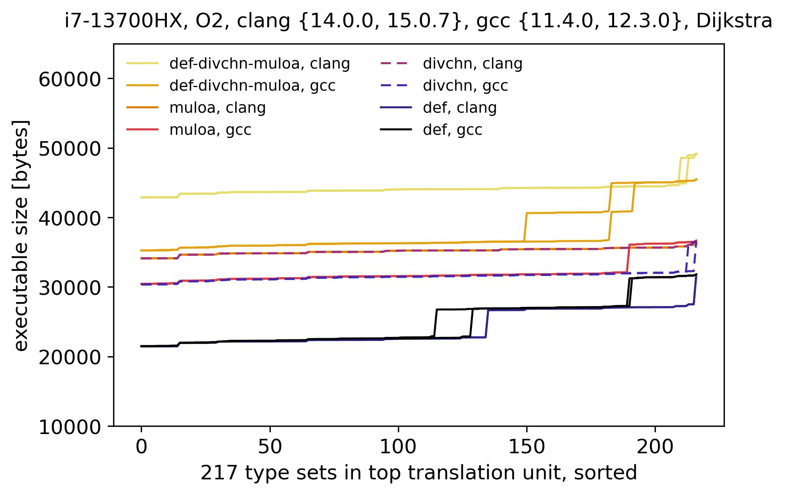
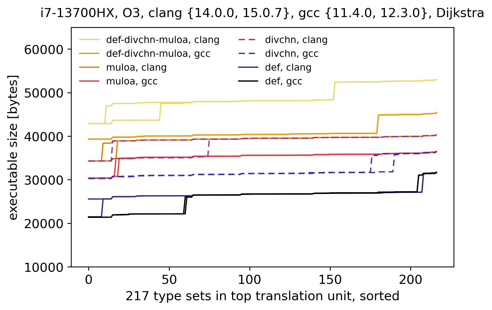

## Evaluation - December 11, 2021 implementation and June 3, 2024 formatting changes

The relationship between the executable size and the number of types in a top translation unit was evaluated. The evaluation was performed on a 13th Generation Intel(R) Core(TM) i7-13700HX Processor (i7-13700HX).

A top translation unit contained a test routine on random graphs over a pair of sets of vertex and weight types. Let L = \{unsigned short, unsigned int, unsigned long\} and M = \{unsigned short, unsigned int, unsigned long, float, double\}. In the top translation unit, the set of vertex types was a non-empty subset of L, and the set of weight types was a non-empty subset of M.

Given a compiler and optimization level, the number of the compiled executables was the product of the number of non-empty subsets in the powerset of L and the number of non-empty subsets in the powerset of M. The compiled executables included the executables compiled with a single vertex type and a single weight type. Two versions of Clang and two versions of GCC were used to detect differences in the sizes of the compiled executables. Either three different hash tables (def-divchn-muloa) and one hash table (def, divchn, muloa) were used, which was reflected in the sizes of the compiled executables.

The executable size remained mostly flat as the number of types in top translation units increased. The implementation complied rigorously with the C89/C90 and C99 standards, including with respect to types. The widths of the integer and floating point types were from 2\*\*4 to 2\*\*6 bits.

The combinatorial generation of top translation units, shown in the Makefiles in `test-size/{def, def-divchn-muloa, divchn, muloa}`, enabled the compilation and linking of tens of thousands of executables across algorithms, compilers, and optimization levels. Parallel execution significantly sped up compilation and linking.

 

    

    

 

The executables across 217 type sets of vertices and weights can be compiled and linked in `test-size/{def, def-divchn-muloa, divchn, muloa}` for each set of hash tables as follows:

`make -jN` 
`make clean` or `make clean-all`

where `N` may be the number of logical cores on a system.

For questions or comments, please feel free to reach out through github.

##
*A i7-13700HX Linux machine was used for the above evaluation.*