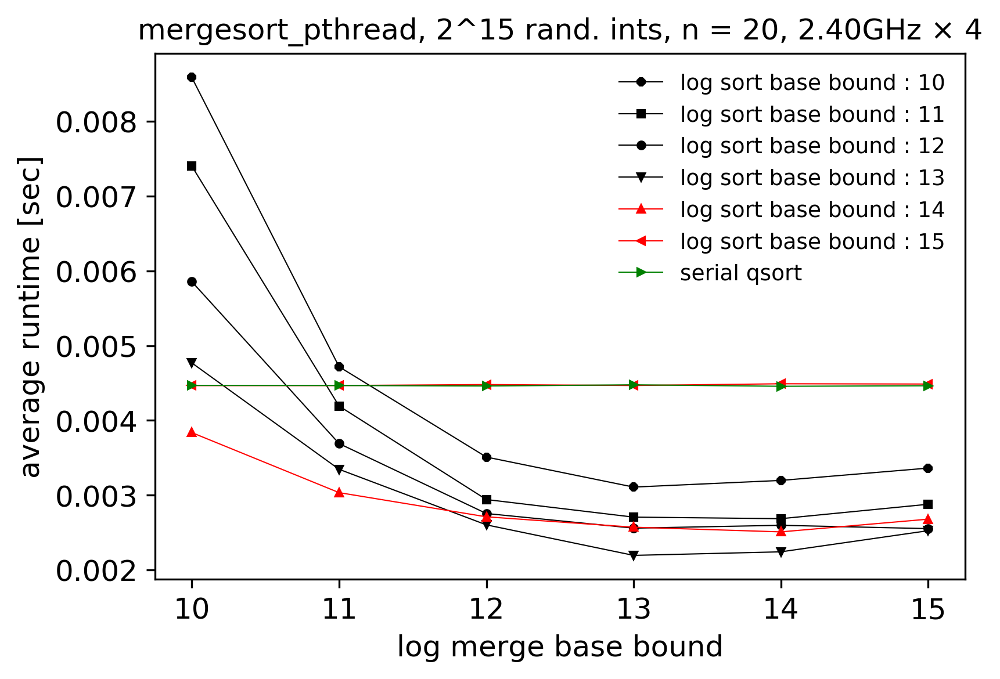
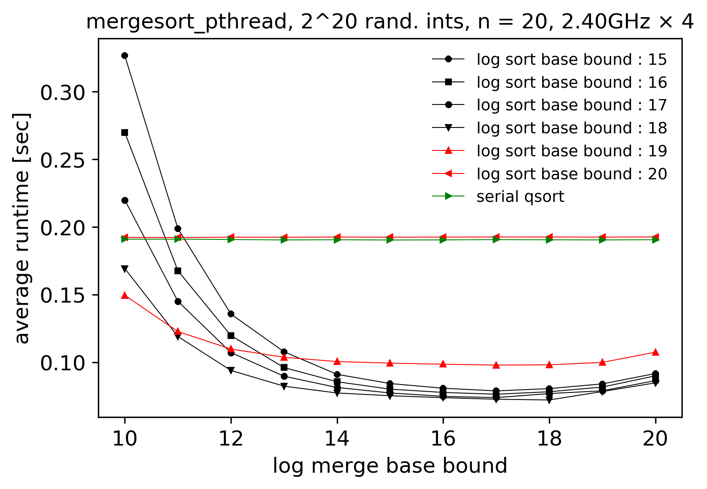

Merge sort algorithm with parallel sorting and parallel merging. The algorithm provides \Theta(n/log^{2}n) theoretical parallelism within the dynamic multithreading model.

The design decouples merge and sort parallelisms for optimization purposes.

The implementation provides i) a set of parameters for setting the constant base case upper bounds for switching from parallel sorting to serial sorting and from parallel merging to serial merging during recursion, and ii) a macro for setting the constant upper bound for the number of recursive calls placed on the stack of a thread across sorting and merging operations, thereby enabling the optimization of the parallelism and the associated overhead across input ranges and hardware settings.

The elements of an input array are generic and the sorting is performed according to a user-defined comparison function.

    
    

