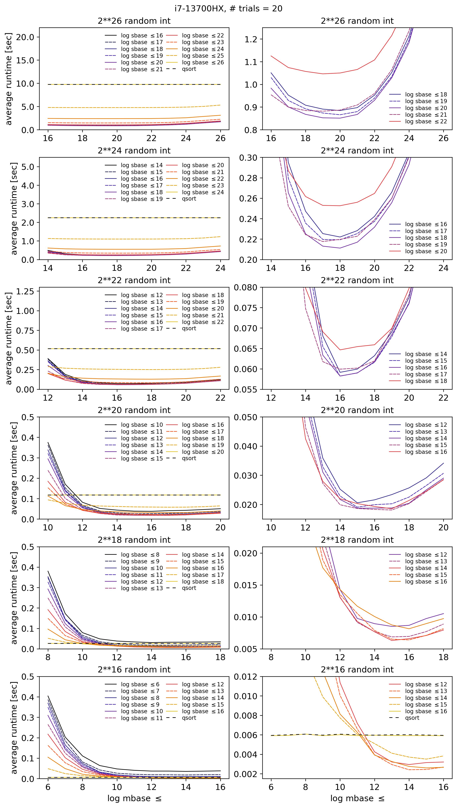
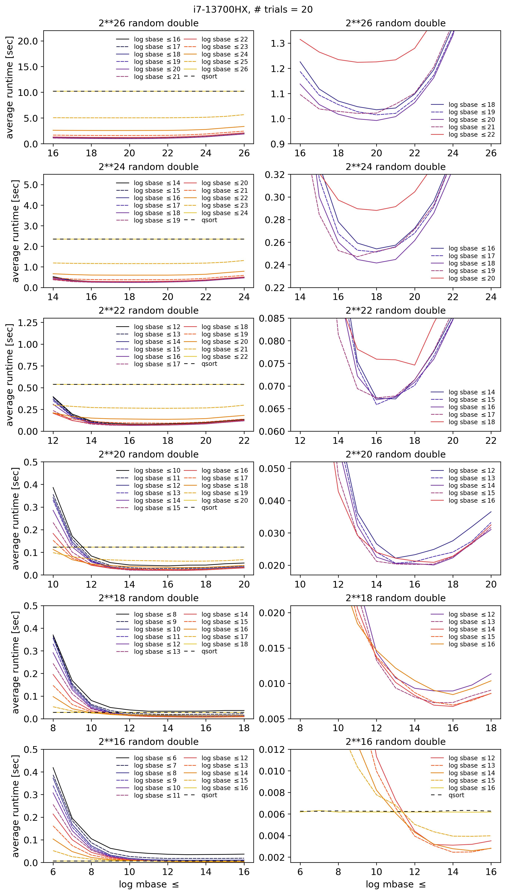
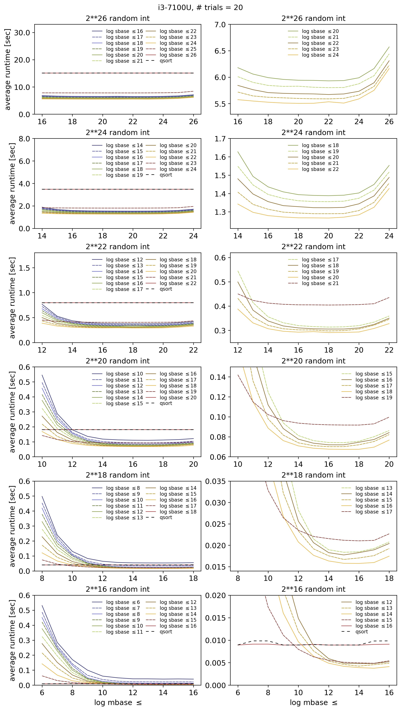
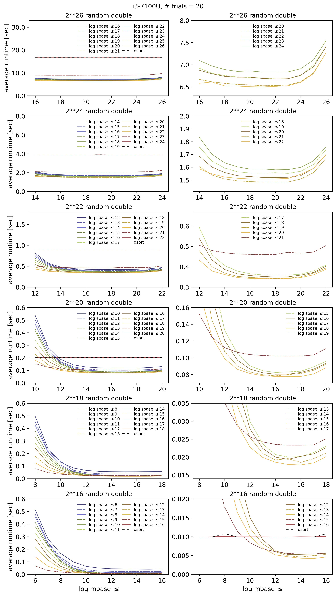
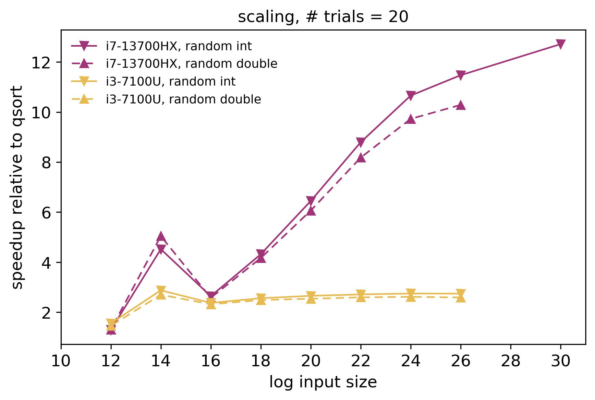
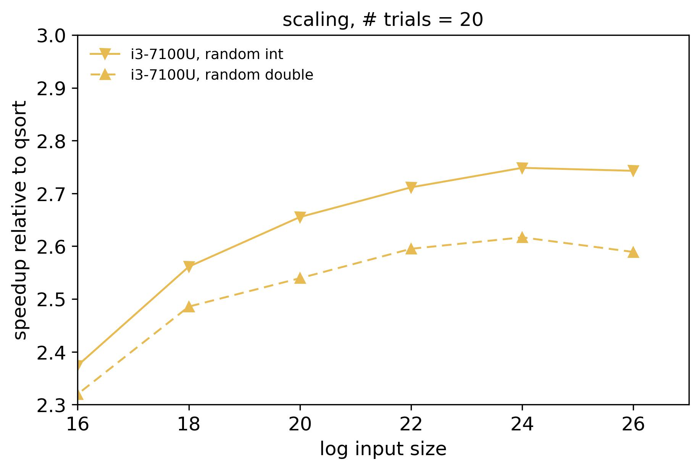
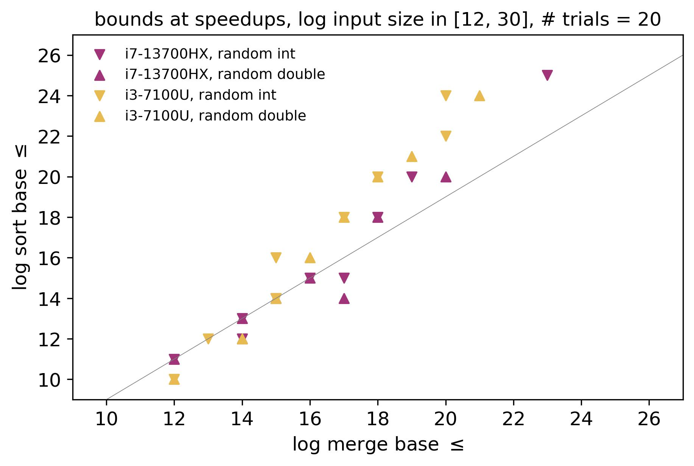
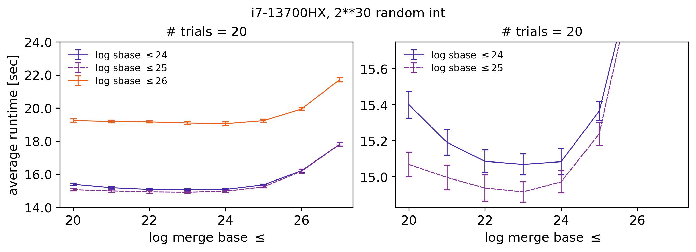
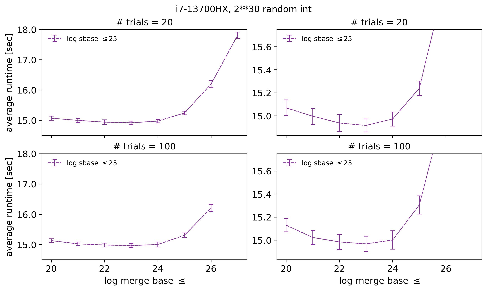

## Design

Merge sort algorithm with decoupled parallel sorting and parallel merging during recursion for optimization purposes. The algorithm provides \Theta(n/log^{2}n) theoretical parallelism within the dynamic multithreading model.

The implementation provides i) a set of parameters for setting the constant base case upper bounds for switching from parallel sorting to serial sorting and from parallel merging to serial merging during recursion, and ii) a macro for setting the constant upper bound for the number of recursive calls placed on the stack of a thread across the main sort routine and the merge subroutine, thereby enabling the optimization of the parallelism and the associated overhead across input sizes and hardware settings.

The elements of an input array are generic and the sorting is performed according to a user-defined comparison function.

## Evaluation - May 11 2021 implementation and April 5 2022 changes

**Speedup and efficiency were evaluated across input sizes on two CPUs with different thread execution capabilities.**

The evaluation was performed on:
- 13th Generation Intel(R) Core(TM) i7-13700HX Processor (i7-13700HX) with Hyper-Threading on 8 of 16 physical cores, providing 24 logical cores, and
- 7th Generation Intel(R) Core(TM) i3-7100U Processor (i3-7100U) with Hyper-Threading on 2 of 2 physical cores, providing 4 logical cores.

Grid search was performed to identify the optimal sort and merge base case upper bounds (base bounds) across different input sizes. Arrays of random 32-bit integer values and random 64-bit double values were used as input. For each pair of sort and merge base bounds, an average runtime was computed from 20 trials, where each trial was run on a newly generated input array.

 

    
    

 

    
    

 

The speedup S for an input size N was computed by dividing the average runtime of serial qsort, measured outside the multithreaded algorithm, by the average runtime of the multithreaded algorithm for every evaluated pair of sort and merge base bounds and then taking the maximum. Let P be the number of processors (logical cores). The efficiency for the input size N was then given by S/P.

**For i7-13700HX with P = 24 and N = 2\*\*26**, the following speedup and efficiency values were obtained:

|                    |          S         |          S/P        |
|        :---:       |        :---:       |         :---:       |
| **random integer** |       11.47        |          0.48       |
| **random double**  |       10.28        |          0.43       |

**For i3-7100U with P = 4 and N = 2\*\*26**, the following speedup and efficiency values were obtained:

|                    |          S         |          S/P        |
|        :---:       |        :---:       |         :---:       |
| **random integer** |        2.74        |          0.69       |
| **random double**  |        2.59        |          0.65       |

From N = 2\*\*24 to N  = 2\*\*26, the slopes of the integer and double speedup curves were positive for  i7-13700HX, in contrast to i3-7100U. Additional evaluation was performed on arrays of 2\*\*30 random integers on i7-13700HX.

 

    

    

 

**For i7-13700HX with P = 24 and N = 2\*\*30**, the following speedup and efficiency values were obtained:

|                    |          S         |          S/P        |
|        :---:       |        :---:       |         :---:       |
| **random integer** |        12.71       |          0.53       |

 

**The merge base bounds were lower than the sort base bounds at the speedup values as the input size increased.**

The following figure shows the merge and sort base bounds at the speedup values across the evaluated input sizes. The gray line shows the baseline scenario, where the logarithm of the merge base bound was greater by one than the logarithm of the sort base bound. Under the baseline scenario, given two sorted subarrays of size 2\*\*m and the merge base bound of 2\*\*(m + 1), a binary search was not performed and the subarrays were merged serially.

 

    

 

The binary search in the parallel merge subroutine was performed on input arrays of random values. At least for this reason, error bars showing plus and minus one standard deviation were included to evaluate the separation of runtime values on arrays of 2\*\*30 random integers on i7-13700HX.

 

    

    

 

The data in the above figures indicate that it was optimal to presort subarrays of size 2\*\*25 with serial qsort and then merge these and larger subarrays at the shallower levels of the main sort recursion with a  smaller granularity of the parallel merge subroutine.

The data further indicate that the optimal sort base bound was 2\*\*25 and the optimal merge base bound was 2\*\*24 or lower. At the level of the main sort recursion, where two subarrays of size 2\*\*25 were sorted with serial qsort, the merge base bound of 2\*\*24 led to a recursion tree depth of the parallel merge subroutine of at least 3, including the first parallel merge call. There were at least two binary searches along the longest path of the parallel merge recursion tree. The number of binary searches increased with non-optimal subproblem splits (1/4 and 3/4 in the worst case). The merge base bound remained constant at the shallower levels of the main sort recursion. But the number of threads was balanced by placing more recursive calls of the parallel merge subroutine on thread stacks according to the MERGESORT_PTHREAD_MAX_ONTHREAD_REC macro, which was set to 20. This algorithm feature controlled the number of threads at the expense of increasing their complexity.

 

**The algorithm design and its highly portable implementation may provide a multithreaded sorting benchmark for CPU manufacturers aiming to improve thread execution capability.**

Radix sort may be the fastest practical (non-comparison) sorting algorithm on a GPU due to the massively parallel compact operation that can be executed with many simple threads. Upto hundreds of thousands of such threads can be executed in parallel at any given time according to the SM specifications of recent NVIDIA GPUs, where simple non-divergent threads enable efficient execution in warps (1). Such massive and simple parallelism is not generally available or desirable on a CPU.

The question of how well a new multicore CPU performs in a multithreaded sorting task relative to another multicore CPU is of general interest. A benchmark should minimize implementation variance and be sensitive to differences between CPUs. A benchmark should also have a thread complexity that is suitable for comparing CPUs.

The presented algorithm design and its C89/C90- and C99-portable implementation in the C language may provide a multithreaded sorting benchmark for CPU manufacturers aiming to improve thread execution capability.

Given the demonstrated sub-second sorting of 2\*\*26 random integer and double values with 24 processors (logical cores) at 0.48 and 0.43 efficiencies respectively, the presented algorithm design and implementation could potentially enable the sorting of more than 1 billion elements under 1 second on a CPU with a higher count of processors. For example, a CPU manufacturer recently announced the plan for a CPU with upto 512 cores (2).

## References:
1. Michael Andersch et al., NVIDIA Hopper Architecture In-Depth, 3/22/2022, https://developer.nvidia.com/blog/nvidia-hopper-architecture-in-depth. Additionally, dynamic parallelism in CUDA and its effect on occupancy are worth mentioning but are beyond the scope of this discussion.
2. Jeff Wittich, Introducing AmpereOne® Aurora, 7/31/2024, https://amperecomputing.com/blogs/introducing-ampereone-aurora

##
*All stated logarithms have the base of 2. The i7-13700HX Linux machine used for the above evaluation had a main memory of 16 GB. The i3-7100U Linux machine had a main memory of 8 GB. The GCC version on both machines was 11.4.0. Compilation was completed according to the provided Makefile.*